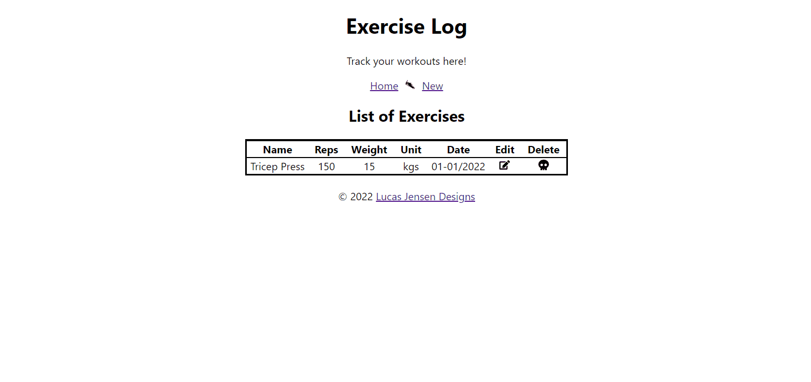
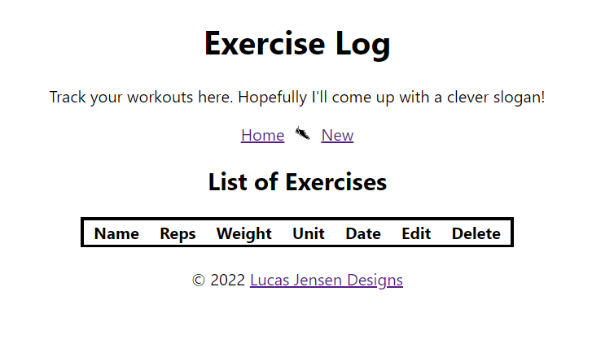
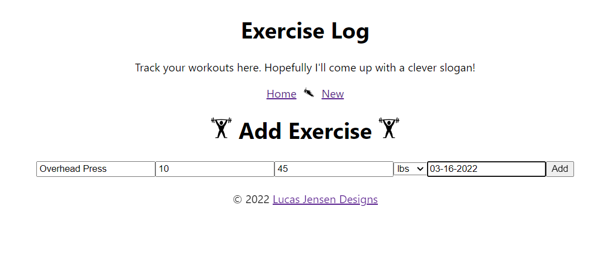
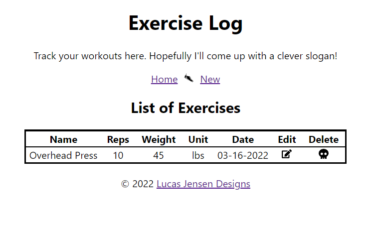

# Exercise React App

This project was build as OSU CS 290's final portfolio project. Improved styling will be added, but everything
functions as intended.

USAGE: `npm install` and `npm run` on both directories. 

The rest api will need a .env file that defines a secret string: `AltasURI`
React will need a .env file that defines `PORT` as an integer (I am using 8000)

Preview of the app working while served locally:

This homepage with an empty db:

Adding an exercise:

Successfully added!

Exercises can also be edited
